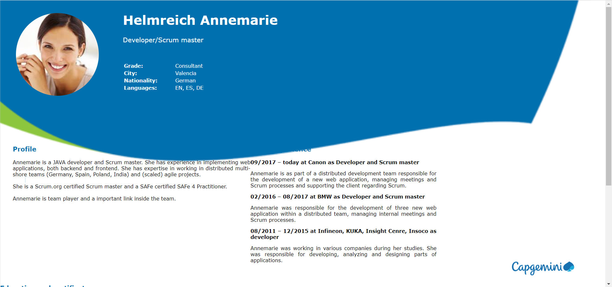
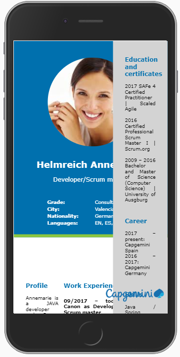

= CSS tutorial
Bárbara de Zárate Boetti 

The objective of this tutorial is to replicate the following CV using exclusively CSS to style and position the elements of a semantic html file.

To do so we will be using SCSS instead of CSS, since it is a very well-known syntax and the official for devonfw. SCSS is a set that includes CSS, so all the CSS syntax will work in a SCSS file. In addition, SCSS gives you many more functionalities and the possibility of creating variables. In this case we will create variables for the two most used colors and font.

[source, scss]
-----------------
$Verdana: Verdana, sans-serif;
$Blue: #0070ae;
$Green: #8cc63f;
-----------------

Create an html file
~~~~~~~~~~~~~~~~~~~

To begin we shall open a new html file and add the text using semantic html, no style given, just the information that we want to show. We will then add style using scss as we said before. 

As shown below, we will structure the information in parts as ‘divs’ to ease the styling and positioning of the elements. We will first need three big blocks which we can differentiate in the example, being the ‘header’, the ‘bodyText’ and the ‘sidebar’. Inside each part we will also differentiate the sections where we need different styling and/or position through another div for each section. The hierarchy will be the following: 

Styling the elements
~~~~~~~~~~~~~~~~~~~~
Once we have all the information to be shown, on the html file, we can start with the scss file. To start we will change the style of each element and we will leave the positioning for later.

In the header, we can find a big profile picture in a circle shape in a size big enough to draw attention and make it look personal. The image element will be surrounded by a div class ‘circleImage’ because as the original image is rectangular we need to make it square by cropping the sides and then rounding the edges to make it look like a circle. 

On our scss file we will add the class and add the properties we just mentioned:

[source, scss]
-----------------
.circleImage {
  width: 13rem;
  height: 13rem;
  overflow: hidden;
  border-radius: 50%;
}
-----------------

As you can see, we add the same width and height values to make it a square, then add the property overflow on hidden value so that the remaining piece of image is cropped out. The last property will be border-radius assigned to 50% to make it completely round.

Then to center the face we will need to assign the height of the image to 100% and add a margin-left to -25%. The code must look something like this:

[source, scss]
-----------------
.profilePicture {
  height: 100%;
  margin-left: -25%;
}
-----------------

Besides the image we can find the person’s name, their job title and some basic information. First we style the name which we have tagged with an h1 (heading 1). We will add the same properties as the example which are Verdana font, bold and size 2rem which corresponds to 32 pixels. We will have to make the width fit the max-content so that it is shown in one line.

[source, scss]
-----------------
h1 {
  font-family: $Verdana;
  font-size: 2rem;
  font-weight: bold;
  width: max-content;
}
-----------------

For the second heading (h2), the job title, we will do the same thing according to its properties: Verdana, size 1rem which is 16 pixels. We will also apply a lighter font weight as it is a subheading.

[source, scss]
-----------------
h2 {
  font-family: $Verdana;
  font-weight: lighter;
  font-size: 1rem;
}
-----------------

The next thing will be the basic information, for this we have chosen to do a table on the html file as it is easier to format with that tabulation position, formatting all the lines at the same time. So we will give style to the text only, with the font Verdana and size 0.8rem which corresponds to almost 13px. Also we will need to make the labels bold, for this sake we have given said labels the class ‘bold’. The result will be as follows:

[source, scss]
-----------------
table {
  font-family: $Verdana;
  font-size: 0.8rem;
  width: 15rem;
}

.bold {
  font-weight: bold;
}
-----------------

The next element we find in our html file is the div ‘bodyText’ which includes the sections ‘profile’ and ‘Work experience’ which are also two different divs themselves. The parent div ‘bodyText’ will be useful to position the elements, as we said this will come later on.

In side of each section we can find a title as a h3 (heading 3) element and some text. To style the h3 element, we need to give it values for font-family, font-size, font-weight and color as given in the example.

[source, scss]
-----------------
h3 {
  font-family: $Verdana;
  font-size: 1rem;
  font-weight: bold;
  color: $Blue;
}
-----------------

This h3 element will be used for the headings of each section of the sidebar too.

Then we will have to style the p element which will be applied in the plain text of each section.

[source, scss]
-----------------
p {
  font-family: $Verdana;
  font-size: 0.8rem;
  text-align: justify;
}
-----------------

We have to take into account that in the ‘Work experience’ section we have the sub headings in bold, for this reason we have also given them the class ‘bold’ mentioned before. 

The last section is the sidebar which contains three sections with a h3 heading each and plain p text. As we have styled them before this will be applied automatically. This section also has an image logo of ‘Capgemini’, which we will see in the next part.

Positioning the elements
~~~~~~~~~~~~~~~~~~~~~~~~
In this second part, we will put everything in its place to finally have a replica of the example.

To begin we will pick off where we left the last section, styling and positioning the logo. For this, we will have to first adjust the size of the image
 and then place it where it should go. We will adjust the width to 10rem and will fix an absolute position at the bottom right corner.

[source, scss]
-----------------
.logo {
  width: 10rem;
  position: absolute;
  top: 90%;
  right: 5%;
}
-----------------

These values should be appropriate.

To be able to position the rest of the elements we will need to set the background first. We will set no-repeat property and cover so that it adjusts to the screen size.

[source, scss]
-----------------
body {
  background-image: url(./assets/backgroundCSS.png);
  background-size: cover;
  background-repeat: no-repeat;
  margin: 0%;
}
-----------------

To position the image, name, title and basic info we will have to take into account the position of the background. For that sake, we will work with the header first, and giving it an inline-flex display so that we see the two divs (‘circleImage’ and ‘basicInfo’) side by side. Then depending on how it is shown on the screen we adjust the paddings, to place it where necessary.

[source, scss]
-----------------
header {
  display: inline-flex;
  padding-left: 2rem;
  padding-top: 0.5rem;
}

.basicInfo {
  padding-left: 3rem;
}

.circleImage {
  margin-left: 0.5rem;
  margin-top: 1.5rem;
}
-----------------

Note that depending on the resolution of our screen we will have to make some adjustments. 

Then for each element inside the ‘basicInfo’ div, we will make some changes. In my case for the table we will add a top padding and we will make all the text in the header be white as the example.

[source, scss]
-----------------
h1 {
  color: white;
}

h2 {
  color: white;
}

table {
  color: white;
  padding-top: 10%;
}
-----------------

Note that we have included a color line so that we see the text in white, over the blue background, as it is in the example.

The next step would be to position the main block in its place. To do so we will follow similar steps to the ones before. The ‘bodyText’ div, that includes the ‘Profile’ and ‘Work Experience’ sections, would need to be displayed with inline-flex like the ‘header’, but this time we will need to fix a set width so that it doesn’t cover the sidebar that we will have on the right. After this we should set some margins to adjust the position, leaving something like this:

[source, scss]
-----------------
.bodyText {
  margin-left: 2rem;
  margin-top: 5rem;
  display: inline-flex;
  width: 70%;
}

h3{
  padding-top: 1.5rem;
}
-----------------

Once we have done this we can visualize the page like the following:

As we can see, we must make some changes on the ‘profile’ div so that it looks more balanced. For that matter we need to add a set width for this section, and also add a margin to separate both parts.

[source, scss]
-----------------
.profile {
  width: 100%;
  margin-right: 5%;
}
-----------------

The last part we need to position and style is the ‘sidebar’. Currently we have it under the rest of the sections and we need to be able to move it to the right part of the screen and set a gray background to differentiate it.

To begin with this we shall try to move it first. To do so the best option is to make the position absolute and move it to the top-right side of the screen using right: 0; and top: 0;.

[source, scss]
-----------------
.sidebar {
  width: 20%;
  background-color: lightgray;
  position: absolute;
  right: 0;
  top: 0;
  height: 100%;
  padding: 0 2rem 0 2rem;
}
-----------------

Finally we should check how it is all visualized and make any adjustments of size or position if necessary. The final result displaying as follows:

Make it responsive
~~~~~~~~~~~~~~~~~~
We would like to be able to see this CV on a mobile phone too, so we should adapt the size and arrangement of the elements to allow proper visualization on a small screen.

To make it responsive we will use media queries. Media queries work like a conditional statement but on scss, this way we can apply different styling options when the size of the screen follows a particular rule.

In our case we will use the following line in our scss file:

[source, scss]
-----------------
@media only screen and (max-width: 800px) {

        ...

}
-----------------

This way we will apply the options specified inside the brackets every time the screen width is below 800px. By default, if an option isn’t specified, it will apply the style given before, so we will only need to specify the things we want to change.

For the mobile display we will want to show the photo in big as the first element, and then each thing centered below. As the space is limited, we won’t be able to have a sidebar so we will place it below the ‘bodyText’.

To do so, in the header we have set a background and a border, to resemble the desktop background. Also we have changed the display so that the text is centered below the image. The code should be something similar to this:

[source, scss]
-----------------
  header {
    background-color: $Blue;
    border-bottom: 0.5rem solid $Green;
    display: block;
    text-align: center;
    padding: 5% 0 5% 0;
    margin: 0%;
  }
  .circleImage {
    display: inline-block;
    width: 15rem;
    height: 15rem;
  }

  .basicInfo {
    display: inline-block;
    margin: 0%;
    padding: 0%;
  }
-----------------

We have also had to change some paddings and margins to adjust the view.

[source, scss]
-----------------
  h1 {
    margin-top: 10%;
    font-size: 1.5rem;
  }

  table {
    padding-top: 10%;
    margin: auto;
  }
  td {
    text-align: left;
  }
-----------------

After doing this the display for the header will be as following:

As you can see we still have the sidebar fixed on the left side. We will want to position it centered under the 'bodyText' as we mentioned before. To do so we must change the position to relative so it is unfixed from the top right corner, and it is relative instead.

[source, scss]
-----------------
  .sidebar {
    width: 80%;
    position: relative;
    padding: 5% 10% 0 10%;
    text-align: center;
  }
-----------------

Now we can see how the sidebar has been placed under the 'bodyText' so we can see now the whole header.

image::assets/examples/image6.png[]

We can observe that the 'bodyText' div is still displayed in two columns. To format it we will change the display to inline-block and we will center it.

[source, scss]
-----------------
  .bodyText {
    text-align: center;
    margin: 0 10% 10% 10%; 
    display: inline-block;
    width: 80%;
  }
-----------------

As you can see we have also modified the alignment to center, so that the logo is shown in the middle. That makes the headings in the sidebar to be centered too, so we shall apply left alignment to the h3 tag. On top of that we shall make some amendments to the logo to change size and position.

[source, scss]
-----------------
  h3 {
    text-align: left;
  }

  .logo {
    width: 40%;
    margin-top: 10%;
    position: relative;
    top: 0%;
    right: 0%;
  }
-----------------

The final display of the three sections will look similar to this:

